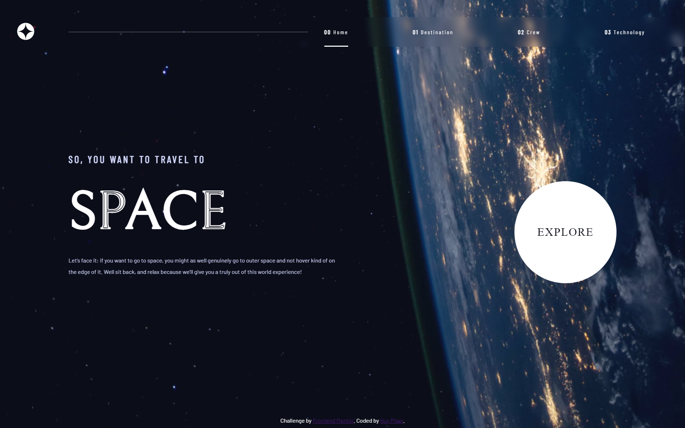

# Frontend Mentor - Space tourism website solution

This is a solution to the [Space tourism website challenge on Frontend Mentor](https://www.frontendmentor.io/challenges/space-tourism-multipage-website-gRWj1URZ3). Frontend Mentor challenges help you improve your coding skills by building realistic projects. 

## Table of contents

- [Overview](#overview)
  - [The challenge](#the-challenge)
  - [Screenshot](#screenshot)
  - [Links](#links)
- [My process](#my-process)
  - [Built with](#built-with)
  - [What I learned](#what-i-learned)
- [Author](#author)

## Overview

### The challenge

Users should be able to:

- View the optimal layout for each of the website's pages depending on their device's screen size
- See hover states for all interactive elements on the page
- View each page and be able to toggle between the tabs to see new information

### Screenshot

### Links
- Live Site URL: [Click here](https://space-tourism-website-tau-swart.vercel.app/)

### Built with

- Angular 15
- Scss

### What I learned

- Angular: Router

## Author

- Github - [Huy Phan](https://github.com/huyphan2210)
- Frontend Mentor - [@huyphan2210](https://www.frontendmentor.io/profile/huyphan2210)
- Linkedin - [Huy Phan](https://www.linkedin.com/in/huy-phan-7924aa25a/)
